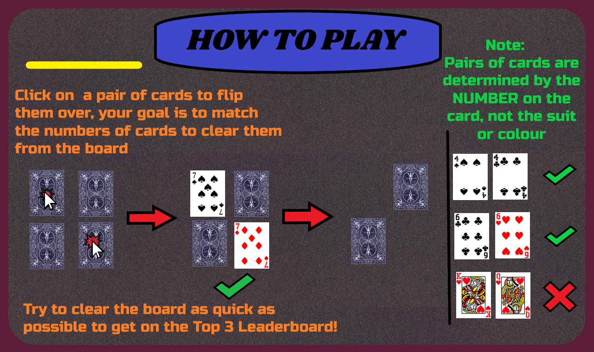
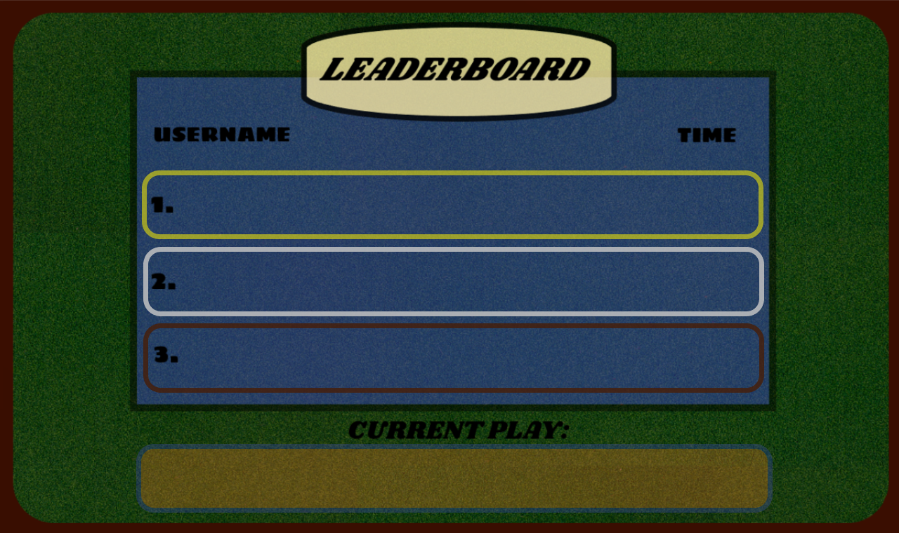

# Match The Cards Game

Welcome to **Match The Cards**, a fun and challenging card-matching game where you need to find pairs of matching cards in the shortest time possible! 

## 🛠️ Game Features

- **Card Matching**: Flip cards to find matching pairs from 4 suits: Diamonds, Hearts, Spades, and Clubs.
- **Timer**: Track how long it takes to match all pairs. Your final time will be saved to the leaderboard.
- **Leaderboard**: Compete against others and see how fast you can complete the game. The top 3 fastest times are displayed.
- **Sound and Visual Effects**: Enjoy smooth animations and card flip effects with custom background music.

## 🚀 How to Play

1. **Start the Game**: Click **START** to begin.
2. **Flip Cards**: Click on any card to flip it. Try to find matching pairs. The game will check the two cards for a match.
3. **Match Cards**: If the cards match, they'll disappear. If they don't, they’ll flip back over.
4. **Complete the Game**: Match all cards to win. Your time will be displayed and saved in the leaderboard.
5. **Restart or Exit**: After finishing, you can restart the game or exit.


## 📊 Leaderboard

- After completing the game, your time will be added to the **Leaderboard**.
- The top 3 players' times will be displayed, and your rank will be updated if you make it to the top 3.
- **Username**: You’ll be prompted to enter a username at the beginning of the game.

## 🖥️ Requirements

- **Python 3.x**: Ensure you have Python 3.x installed on your system.
- **Pygame**: This game uses Pygame for graphics and event handling. You can install it using:

    ```bash
    pip install pygame
    ```

- **pygameRogers**: A custom game module used for managing game objects and rooms. Ensure the module is available in your environment.

## ⚙️ Installation

1. Clone or download the repository to your local machine.
2. Navigate to the game directory and install Pygame (if not installed yet).
3. Run the game script using:

    ```bash
    python match_the_cards.py
    ```
